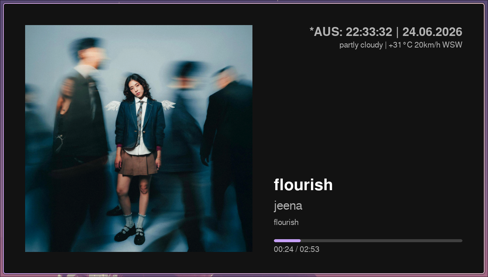

# displayThingy

An aesthetic, real-time smart display dashboard built with Pygame. It dynamically showcases Spotify playback status (track, artist, album, cover art, and progress) paired with a cycling world clock and weather metrics.

---

## Purpose
`displayThingy` serves as a desktop widget or an ambient smart display (optimized for platforms like the Raspberry Pi). It offers:
* **Real-time Spotify Tracking**: Automatic polling, track transition logs, podcast/music separation, and local progress interpolation (to minimize API requests).
* **World Clock cycles**: Cycles through multiple configurable timezones, showing formatted times, dates, and day offsets relative to a "home" reference timezone.
* **Periodic Weather Updates**: Fetches condition details, temperature, and wind from the `wttr.in` JSON API periodically in background threads.
* **Ambient Click-to-Dim**: Click or tap the center of the display to dim the dashboard for low-light or nighttime settings.


## Example Output



---

## Code Structure

The project uses a clean, decoupled MVC-like separation of configurations, widgets (data retrieval), and views (rendering):

```
displayThingy/
├── configs.json                # Profile resolution and view definitions
├── main.py                     # App entry point and window orchestrator
├── test_error_handling.py      # Unit testing suite
├── shell.nix / requirements.txt# Dependency environment configurations
├── widgets/                    # Core widgets handling data retrieval & calculations
│   ├── world_clock/
│   │   └── clock.py            # Local timezone and date offset tracker
│   ├── weather/
│   │   └── weather.py          # Periodic, async weather fetcher using wttr.in JSON API
│   └── spotify/
│       ├── spotify.py          # Spotify API fetch, authentication & interpolation
│       └── spotify-playlist.py # Standalone playlist analyzer (visualizes top artists)
└── views/                      # Presentation layer defining layouts
    ├── base_view.py            # Abstract BaseView layout
    ├── spotify_base_view.py    # Common layout for drawing Spotify interfaces
    ├── spotify_only_view.py    # Subclass drawing only Spotify player
    ├── spotify_clock_view.py   # Subclass drawing Spotify + Clock line
    ├── spotify_weather_view.py # Subclass drawing Spotify + Weather line
    └── spotify_clock_weather_view.py # Subclass drawing Spotify + Clock + Weather (double line)
```

### File & Class Reference:
* **[main.py](main.py)**: Houses [SpotifyDisplay](main.py#L14), which loads profiles, manages Pygame screen setup, tick clocks, and forwards drawing loops.
* **[configs.json](configs.json)**: Stores parameters for resolutions, frames-per-second, fullscreen preferences, and widget intervals.
* **[widgets/world_clock/clock.py](widgets/world_clock/clock.py)**: Houses [WorldClockWidget](widgets/world_clock/clock.py#L5) for cycle math and time formatting.
* **[widgets/weather/weather.py](widgets/weather/weather.py)**: Houses [WeatherWidget](widgets/weather/weather.py#L5) for background weather fetching.
* **[widgets/spotify/spotify.py](widgets/spotify/spotify.py)**: Houses [SpotifyWidget](widgets/spotify/spotify.py#L139) for playback updates.
* **[views/spotify_base_view.py](views/spotify_base_view.py)**: Houses [SpotifyBaseView](views/spotify_base_view.py#L12) which defines visual themes, margins, wrapping and dimming overlays.

---

## Installation & Setup

### 1. Environment Variables
Authentication credentials are required for Spotify.
* Copy the template to `.env`:
  ```bash
  cp .env.template .env
  ```
* Register an application on the [Spotify Developer Dashboard](https://developer.spotify.com/dashboard) and populate the `.env` file with your `SPOTIPY_CLIENT_ID`, `SPOTIPY_CLIENT_SECRET`, and `SPOTIPY_REDIRECT_URI`.

### 2. Enter Development Environment (Nix)
If you have Nix installed, load all dependencies (including python libraries like `spotipy`, `pygame`, `pytz`, and `pandas`) automatically:
```bash
nix-shell
```
*(Or install packages in [requirements.txt](requirements.txt) manually using python virtual environments).*

---

## Usage

### Profiles
We configure target profiles inside [configs.json](configs.json). You can select which profile to run using the `-p` or `--profile` flag:

* **Default Profile** (1280x720 window, Clock + Weather):
  ```bash
  nix-shell --run "python main.py"
  ```
* **Raspberry Pi Profile** (1024x600 window, fullscreen, Clock + Weather):
  ```bash
  nix-shell --run "python main.py -p raspi"
  ```
* **Framework 13 Profile** (2880x1920 window, Clock + Weather):
  ```bash
  nix-shell --run "python main.py -p framework13"
  ```

### CLI Overrides
Dynamic flags can override active profile defaults:
* `--fullscreen`: Toggle full-screen mode.
* `--width <px>` & `--height <px>`: Manually define window size.
* `--show-clock` / `--no-clock`: Force show/hide the world clock.
* `--show-weather` / `--no-weather`: Force show/hide the weather status.
* `--test-error`: Simulate an API connection failure to test the warning bar.

---

## Unit Testing

Run the test suite inside the environment to verify mock structures and API handler logic:
```bash
nix-shell --run "python -m unittest test_error_handling.py"
```

---

## Raspberry Pi Autostart Configuration

The Raspberry Pi (running Raspberry Pi OS with `labwc` compositor) is configured to automatically launch the widget on startup:

1. **Autostart file**: `~/.config/labwc/autostart`
   Contains:
   ```bash
   lxterminal -e ~/Documents/displayThingy/run_display.sh &
   ```
2. **Launch script**: `~/Documents/displayThingy/run_display.sh`
   Sets up path, activates Python virtual environment (`.dt_venv`), and runs `main.py` with custom flags:
   ```bash
   cd ~/Documents/displayThingy
   source .dt_venv/bin/activate
   python main.py --width 1024 --height 600 --fullscreen
   ```